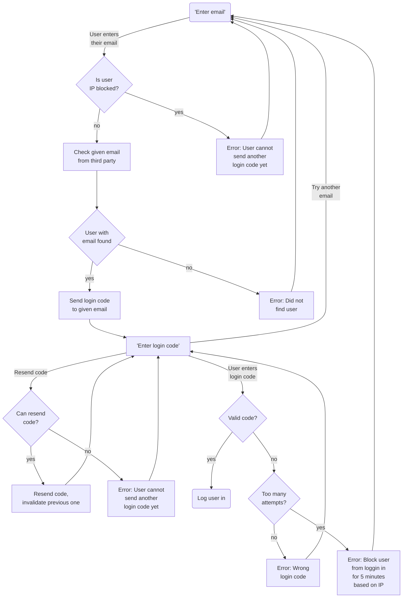

# Usage

## Backend

1. Send a login code to the *authentication* endpoint (from `SendLoginCodeView` class).

| Request                                                      | Response            |
|--------------------------------------------------------------|---------------------|
| POST [Authentication URI] <br>Content-Type: application/json | HTTP 204 NO CONTENT |
| {<br>  "email":"person@example.com"<br>}                     | ...                 |


2. POST the login code and email to *login* endpoint (from `LoginView` class).

| Request                                                       | Response                                        |
|---------------------------------------------------------------|-------------------------------------------------|
| POST [Login URI] <br>Content-Type: application/json           | HTTP 200 OK                                     |
| {<br>  "email":"person@example.com"<br>  "code":"123222"<br>} | {<br>  "access":"..."<br>  "refresh":"..."<br>} |


> If both `USE_TOKENS` and `USE_COOKIES` are enabled, you can select the wanted login method
> via the `Prefer` header´. Set it to `token` or `cookies` to select one or the other. If not set,
> the value will be determined from `DEFAULT_LOGIN_METHOD`, but if this is not set the default
> will be `cookies` if cookies are enabled, and `token` if not.


3. Refresh access token from the *refresh token* endpoint (from `RefreshTokenView` class).

| Request                                                     | Response                                        |
|-------------------------------------------------------------|-------------------------------------------------|
| POST [Refresh Token URI] <br>Content-Type: application/json | HTTP 200 OK                                     |
| {<br>  "token":"..."<br>}                                   | {<br>  "access":"..."<br>  "refresh":"..."<br>} |

> If `ROTATE_REFRESH_TOKENS` is in use, the given refresh token will be a new refresh token,
> and the old refresh token will no longer be valid. Otherwise, the token will be the same
> same token used on the endpoint.


### Authentication and Permission classes

Add the `JWTAuthentication` or `HasValidJWT` to Rest framework's settings,
or to the class's `authentication_classes` or `permission_classes`

```python
from rest_framework.views import APIView
from jwt_email_auth.authentication import JWTAuthentication
from jwt_email_auth.permissions import HasValidJWT


class SomeView(APIView):

    authentication_classes = [JWTAuthentication]
    permission_classes = [HasValidJWT]

    ...
```

### Base Access Serializer

If you need to use claims from the token in you code, you can use the `BaseAccessSerializer`.

```python
from rest_framework import serializers
from rest_framework.views import APIView
from jwt_email_auth.serializers import BaseAccessSerializer
from jwt_email_auth.authentication import JWTAuthentication
from jwt_email_auth.permissions import HasValidJWT


class SomeSerializer(BaseAccessSerializer):

    take_from_token = ["example", "values"]

    some = serializers.CharField()
    data = serializers.CharField()

    ...


class SomeView(APIView):

    authentication_classes = [JWTAuthentication]
    permission_classes = [HasValidJWT]

    def post(self, request, *args, **kwargs):

        data = {"some": ..., "data": ...}

        # Request is needed in serializer context to get the access token
        serializer = SomeSerializer(data=data, context={"request", request})
        serializer.is_valid(raise_exception=True)

        data = serializer.validated_data
        # ...or this
        # data = serializer.data

        print(data)  # {"some": ..., "data": ..., "example": ..., "values": ...}
        ...
```


## Frontend

To implement authentication with this library in the frontend,
you'll need a way to call the `SendLoginCodeView` and `LoginView`
for authentication, and then implement a way to automatically
call `RefreshTokenView` when your access token expires or is about
to expire. You'll also need to implement views/logic for all the
possible error responses from each of these views.

>
> SendLoginCodeView
>
> - 400: Input is incorrect
> - 412: User is blocked from login due to too many attempts
> - 503: Could not send login code
>
> LoginView
>
> - 400: Input is incorrect
> - 403: Given login code was incorrect
> - 404: No login code has been sent for this user, or the code has expired
> - 410: Login data was corrupted
> - 412: User has been blocked due to too many attempts
>
> RefreshTokenView
>
> - 400: Input is incorrect
> - 403: Refresh token expired, or otherwise invalid
> - 404: Refresh token user no longer exists (requires "user_check=True" in refresh view)
>

When using the JWT in views using the `JWTAuthentication` and `HasValidJWT`
authentication and permission classes, you need to always listen for 403
responses, and try to call `RefreshTokenView` in case the access token has
expired. In case `RefreshTokenView` also returns 403, this usually means
that the refresh token has also expired, and the user should be asked
to re-authorize.

In case you are using [JWT rotation][jwt-rotation], when you call
`RefreshTokenView`, the returned refresh token will also need to be saved,
as the old one is invalidated. Using JWT rotation can save your users from
having to reauthorize when their initial refresh token expires.



A flowchart describing a possible implementation.


## Non-email authentication

Even though "email" is in the name of the library, it can be used
to authenticate via other means, e.g., SMS. The library tries
not to refer to email specifically, so that all documentation is still
relevant if the authentication method is something other than email.

All you'll need to do is create new serializers for `SendLoginCodeView`
and `LoginView` which replace the "email" field with something else.
Then, you can implement `SEND_LOGIN_CODE_CALLBACK` using that field's
value. Here is an example using phone number for SMS authentication:

```python
# myapp/views.py
from rest_framework import serializers
from jwt_email_auth.serializers import BaseSendLoginCodeSerializer, BaseLoginSerializer
from jwt_email_auth import views as jwt_views

# Should have one field of any type
class SendLoginCodeSerializer(BaseSendLoginCodeSerializer):
    phone = serializers.CharField(help_text="Phone number to send the code to.")

# Should have one field of any type
class LoginSerializer(BaseLoginSerializer):
    phone = serializers.CharField(help_text="Phone number the code was sent to.")

class SendLoginCodeView(jwt_views.SendLoginCodeView):
    serializer_class = SendLoginCodeSerializer

class LoginView(jwt_views.LoginView):
    serializer_class = LoginSerializer
```

```python
# myapp/utils.py
from typing import Any
from rest_framework.request import Request

def send_login_code_via_sms(
    phone: str,
    login_data: dict[str, Any],
    request: Request,
) -> None:
    ...
```

```python
# myproject/settings.py
JWT_EMAIL_AUTH = {
    ...
    "SEND_LOGIN_CODE_CALLBACK": "myapp.utils.send_login_code_via_sms",
    ...
}
```

[jwt-rotation]: https://mrthearman.github.io/jwt-email-auth/rotation/
